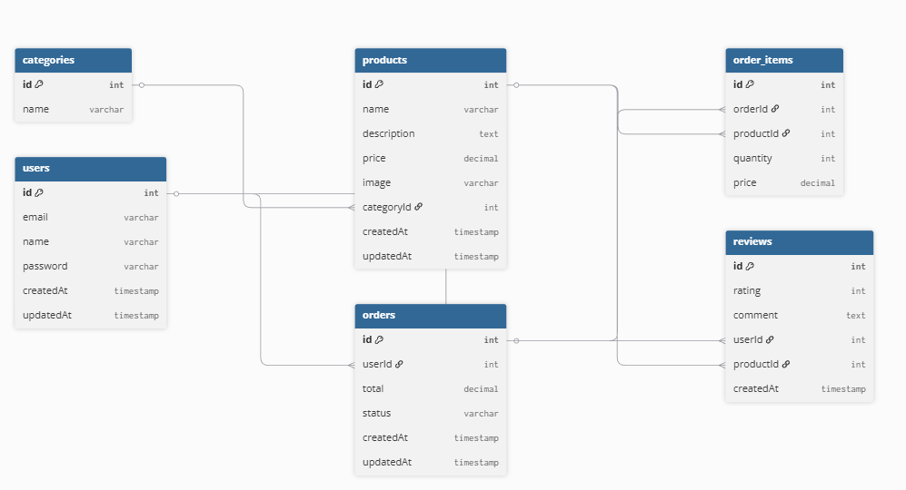

# 🎸 MusicStore - Интернет-магазин гитар

**MusicStore** — это полнофункциональный веб-сайт для продажи гитар и музыкальных инструментов. Проект разработан в рамках лабораторных работ по веб-разработке и развернут на платформе Render.

## 🚀 Демо

**Ссылка на развёрнутое приложение:**  
👉 [https://m3314-shevtsov-backend.onrender.com](https://m3314-shevtsov-backend.onrender.com)

> *Примечание: бесплатный тариф Render может останавливать приложение при отсутствии активности. При первом открытии подождите 30-60 секунд, пока сервер запустится.*

---

## 📋 О проекте

MusicStore — это интернет-магазин, специализирующийся на продаже гитар и сопутствующих товаров. На сайте представлен широкий ассортимент инструментов от ведущих мировых производителей.

### Основные возможности:

- 📱 **Адаптивный дизайн** — комфортный просмотр на всех устройствах
- 🎸 **Каталог товаров** с фильтрацией по категориям, цене и брендам
- 🛒 **Корзина покупок** с возможностью добавлять/удалять товары
- 🔧 **Добавление услуг** по настройке инструментов
- 💳 **Кредитный калькулятор** для расчета ежемесячных платежей
- 👤 **Два состояния сессии** (авторизован/неавторизован) через параметр `?auth=true`
- 📊 **Загрузка отзывов** из внешнего API (JSONPlaceholder)
- 🎨 **Галерея изображений** с использованием Swiper.js

---

## 🛠️ Технологии

### Frontend:
- HTML5, CSS3 (с использованием БЭМ-методологии)
- JavaScript (ES6+), модульная структура
- Swiper.js для галереи
- Inputmask для форматирования телефона

### Backend:
- **Node.js** (версия 22.x)
- **NestJS** — прогрессивный фреймворк для Node.js
- **EJS** — шаблонизатор для генерации HTML
- Express под капотом

### Хостинг и деплой:
- **Render.com** — облачный хостинг
- **GitHub** — система контроля версий
- Автоматический деплой при пуше в main-ветку

### База данных
Проект использует реляционную базу данных **PostgreSQL**, развернутую на **Render**. База данных спроектирована в соответствии с принципами DDD и включает 6 основных сущностей.
- **СУБД**: PostgreSQL 16
- **ORM**: TypeORM
- **Хостинг**: Render (PostgreSQL)
- 
#### ER-диаграмма:

---

## 📚 **Краткое описание лабораторных работ**

---

### **Лабораторная работа №1: Деплой на Render и шаблонизация**

**Что требовалось:**
- Развернуть NestJS приложение на хостинге Render
- Подключить шаблонизатор (EJS)
- Выделить повторяющиеся блоки в partials (header, footer, menu, session)
- Настроить раздачу статики

**Что сделано:**
- ✅ Приложение задеплоено на Render
- ✅ Подключен EJS шаблонизатор
- ✅ Создана структура partials: `head.ejs`, `header.ejs`, `menu.ejs`, `session.ejs`, `footer.ejs`, `scripts.ejs`
- ✅ Настроена раздача статических файлов (CSS, JS, изображения)
- ✅ Реализовано два состояния сессии через query-параметр `?auth=true/false`

---

### **Лабораторная работа №2: Создание доменной модели и её описание**

**Что требовалось:**
- Развернуть реляционную СУБД (PostgreSQL)
- Спроектировать и реализовать модель данных (минимум 5 сущностей)
- Создать ER-диаграмму
- Настроить миграции

**Что сделано:**
- ✅ База данных PostgreSQL развернута на Render
- ✅ Созданы 6 сущностей: `User`, `Category`, `Product`, `Order`, `OrderItem`, `Review`
- ✅ Настроены связи между сущностями (OneToMany, ManyToOne)
- ✅ Созданы миграции для управления схемой БД
- ✅ Сгенерирована ER-диаграмма
- ✅ Сущности связаны с TypeORM и интегрированы в приложение

---

### **Лабораторная работа №3: Интеграция шаблонов с бизнес-логикой и SSE**

**Что требовалось:**
- Описать поддомены и создать модули
- Реализовать CRUD операции для сущностей
- Адаптировать шаблоны для работы с реальными данными
- Добавить Server-Sent Events (SSE) для уведомлений в реальном времени

**Что сделано:**
- ✅ Созданы модули для `products`, `categories`, `orders`, `users`, `reviews`
- ✅ Реализованы сервисы с бизнес-логикой
- ✅ Написаны MVC контроллеры для управления сущностями
- ✅ Добавлены страницы для создания, редактирования и просмотра товаров/категорий
- ✅ Реализованы формы добавления и редактирования
- ✅ Добавлен SSE эндпоинт `/products/events`
- ✅ Настроены уведомления через toastr при создании/обновлении/удалении товаров

---

### **Лабораторная работа №4: Разработка RESTful API и его спецификации**

**Что требовалось:**
- Создать API контроллеры для всех сущностей
- Реализовать пагинацию с Link-заголовками
- Добавить валидацию входных данных
- Реализовать глобальный ExceptionFilter
- Подключить Swagger/OpenAPI документацию

**Что сделано:**
- ✅ Созданы API контроллеры: `ProductsApiController`, `CategoriesApiController`, `OrdersApiController`, `UsersApiController`, `ReviewsApiController`
- ✅ Реализованы все CRUD операции с правильными HTTP методами
- ✅ Добавлена пагинация с параметрами `page` и `limit`
- ✅ Настроены DTO с валидацией через `class-validator`
- ✅ Реализован глобальный `AllExceptionsFilter` для обработки ошибок
- ✅ Подключен Swagger UI по адресу `/api/docs`
- ✅ Добавлены вложенные ресурсы (`/api/categories/:id/products`, `/api/users/:id/orders`)

---

### **Лабораторная работа №5: Разработка схемы GraphQL**

**Что требовалось:**
- Настроить GraphQL модуль (code-first подход)
- Создать Object Types и Input Types для всех сущностей
- Реализовать Resolvers (Query и Mutation)
- Добавить пагинацию в GraphQL
- Настроить песочницу Apollo Sandbox

**Что сделано:**
- ✅ Подключен `GraphQLModule` с Apollo Driver
- ✅ Созданы Object Types: `UserType`, `CategoryType`, `ProductType`, `OrderType`, `ReviewType`
- ✅ Созданы Input Types для создания и обновления
- ✅ Написаны Resolvers с методами `products()`, `product()`, `createProduct()`, `updateProduct()`, `deleteProduct()` и аналогично для других сущностей
- ✅ Реализована пагинация через `PaginationArgs` и `Paginated` тип
- ✅ Доступна песочница Apollo Sandbox по адресу `/graphql`
- ✅ Реализованы вложенные запросы (например, получение товаров категории)

---

### **Лабораторная работа №6: BFF (Backend for Frontend)**

**Что требовалось:**
- Реализовать Interceptor для измерения времени обработки запросов
- Добавить кэширование ответов (in-memory)
- Настроить ETag и Cache-Control
- Реализовать загрузку файлов в объектное хранилище (Yandex Cloud)

**Что сделано:**
- ✅ Создан `TimingInterceptor` для измерения времени запросов
- ✅ Добавлен заголовок `X-Elapsed-Time` и передача `loadTime` в шаблоны
- ✅ Настроен `CacheModule` с TTL для популярных товаров
- ✅ Создан `EtagInterceptor` для генерации ETag и настройки Cache-Control
- ✅ Подключено хранилище Yandex Cloud Object Storage через AWS SDK
- ✅ Создан эндпоинт `POST /api/products/upload-image` для загрузки файлов
- ✅ Добавлена валидация файлов (размер, тип)

---

### **Лабораторная работа №7: Добавление аутентификации и авторизации**

**Что требовалось:**
- Внедрить провайдера аутентификации (SuperTokens)
- Реализовать регистрацию, вход и выход
- Создать две роли: `user` и `admin`
- Настроить Guards для защиты маршрутов
- Обновить фронтенд для отображения состояния авторизации

**Что сделано:**
- ✅ Подключен SuperTokens с облачной инфраструктурой
- ✅ Создан динамический модуль `AuthModule`
- ✅ Реализованы эндпоинты: `/auth/signup`, `/auth/signin`, `/auth/signout`, `/auth/session`
- ✅ Настроена передача роли в Access Token Payload
- ✅ Создан `RolesGuard` для проверки прав доступа
- ✅ Добавлен декоратор `@Roles('admin')` для защиты маршрутов
- ✅ Настроены CORS и фильтры для SuperTokens
- ✅ Обновлены страницы логина и регистрации
- ✅ Администратор видит пункты управления товарами, категориями и пользователями
- ✅ Обычный пользователь имеет доступ только к профилю и заказам

---

## 📊 **Итоговая функциональность**

| Функция | Статус |
|---------|--------|
| REST API | ✅ Работает |
| GraphQL API | ✅ Работает |
| Аутентификация | ✅ Работает (SuperTokens) |
| Авторизация (роли) | ✅ Работает |
| Пагинация | ✅ Работает |
| Кэширование | ✅ Работает |
| Загрузка файлов | ✅ Работает (Yandex Cloud) |
| SSE уведомления | ✅ Работает |
| Swagger документация | ✅ Доступна |
| GraphQL Sandbox | ✅ Доступен |

---

## 👤 Автор

**Студент:** Роман Шевцов  
**Группа:** M3314  
**Дата выполнения:** Февраль 2026

- GitHub: [@is-web-y27](https://github.com/is-web-y27)
- Репозиторий проекта: [https://github.com/is-web-y27/m3314-shevtsov-backend](https://github.com/is-web-y27/m3314-shevtsov-backend)
